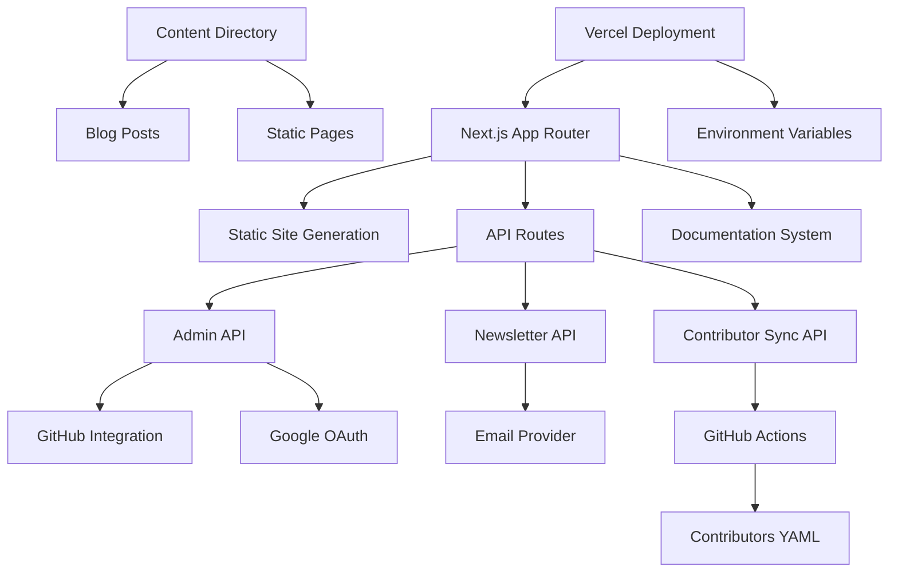
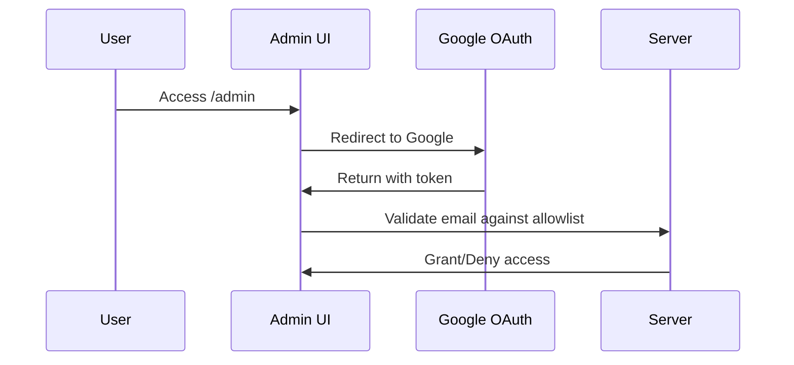
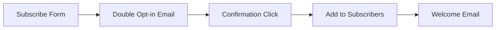
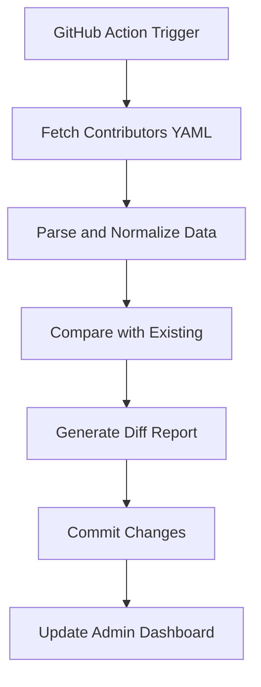

# Design Document

## Overview

This design document outlines the architecture and implementation approach for refactoring the GitMesh Community Edition website into a code-first, open-source friendly, Vercel-deployable platform. The solution leverages Next.js App Router with a Git-based content management system, OSS documentation platform, and secure admin interface.

## Architecture

### High-Level Architecture



### Technology Stack

- **Frontend Framework**: Next.js 15+ with App Router
- **Styling**: Tailwind CSS with existing component library
- **Documentation**: Nextra (MDX-based) - chosen for seamless Next.js integration
- **Authentication**: NextAuth.js with Google OAuth
- **Content Management**: Git-based with GitHub API integration
- **Email Service**: SendGrid/SES via environment configuration
- **Deployment**: Vercel with GitHub Actions for automation
- **Database**: File-based storage for simplicity and transparency

## Components and Interfaces

### 1. Content Management System

#### File Structure
```
/content/
  /blog/
    2024-01-15-post-title.mdx
    2024-01-20-another-post.mdx
  /pages/
    about.mdx
    governance.mdx
/data/
  contributors.json
  newsletter-subscribers.json
  admin-config.json
```

#### Content Schema
```typescript
interface BlogPost {
  slug: string
  title: string
  excerpt: string
  content: string
  author: string
  publishedAt: Date
  tags: string[]
  featured: boolean
  newsletter: boolean
}

interface Contributor {
  name: string
  github: string
  role: string
  avatar: string
  contributions: number
}
```

### 2. Admin Interface

#### Authentication Flow


#### Admin Dashboard Components
- **Content Editor**: MDX editor with live preview
- **Media Manager**: Image upload and management
- **Newsletter Manager**: Subscriber management and campaign creation
- **Site Analytics**: Basic diagnostics and sync status
- **User Management**: Admin email allowlist management

### 3. Documentation System (Nextra)

#### Configuration
```javascript
// next.config.js
const withNextra = require('nextra')({
  theme: 'nextra-theme-docs',
  themeConfig: './theme.config.tsx'
})

module.exports = withNextra({
  // ... existing config
})
```

#### Migration Strategy
1. **Content Extraction**: Parse GitBook markdown files
2. **Structure Mapping**: Convert to Nextra file structure
3. **URL Preservation**: Implement redirects for existing URLs
4. **Search Integration**: Configure built-in search functionality

### 4. Newsletter System

#### Subscription Flow


#### GDPR Compliance
- Explicit consent tracking
- Unsubscribe mechanism
- Data export capability
- Retention policy implementation

### 5. Contributor Automation

#### Daily Sync Process


## Data Models

### User Management
```typescript
interface AdminUser {
  email: string
  name: string
  avatar: string
  role: 'admin' | 'super_admin'
  lastLogin: Date
  permissions: Permission[]
}

interface Permission {
  resource: 'blog' | 'newsletter' | 'users' | 'diagnostics'
  actions: ('create' | 'read' | 'update' | 'delete')[]
}
```

### Content Models
```typescript
interface NewsletterSubscriber {
  email: string
  name?: string
  subscribedAt: Date
  confirmed: boolean
  tags: string[]
  unsubscribeToken: string
}

interface SiteConfig {
  maintenance: boolean
  featuredPosts: string[]
  announcementBanner?: {
    text: string
    link?: string
    variant: 'info' | 'warning' | 'success'
  }
}
```

## Error Handling

### API Error Responses
```typescript
interface APIError {
  code: string
  message: string
  details?: any
  timestamp: Date
}

// Standard error codes
enum ErrorCodes {
  UNAUTHORIZED = 'UNAUTHORIZED',
  FORBIDDEN = 'FORBIDDEN',
  NOT_FOUND = 'NOT_FOUND',
  VALIDATION_ERROR = 'VALIDATION_ERROR',
  GITHUB_API_ERROR = 'GITHUB_API_ERROR',
  EMAIL_SERVICE_ERROR = 'EMAIL_SERVICE_ERROR'
}
```

### Error Boundaries
- **Admin Interface**: Graceful degradation with retry mechanisms
- **Content Loading**: Fallback to cached content
- **External Services**: Circuit breaker pattern for GitHub/email APIs

## Testing Strategy

### Unit Testing
- **Components**: React Testing Library for UI components
- **API Routes**: Jest for API endpoint testing
- **Utilities**: Pure function testing for content parsing and validation

### Integration Testing
- **Authentication Flow**: End-to-end OAuth testing
- **Content Management**: GitHub API integration testing
- **Email Service**: Mock email provider testing

### E2E Testing
- **Admin Workflows**: Playwright for critical admin paths
- **Public Site**: Core user journeys and accessibility testing

### Performance Testing
- **Lighthouse CI**: Automated performance monitoring
- **Bundle Analysis**: Regular bundle size monitoring
- **Core Web Vitals**: Continuous monitoring in production

## Security Considerations

### Authentication & Authorization
- **OAuth Scopes**: Minimal required permissions
- **Session Management**: Secure JWT handling with rotation
- **CSRF Protection**: Built-in Next.js CSRF protection
- **Rate Limiting**: API endpoint protection

### Content Security
- **Input Sanitization**: MDX content sanitization
- **File Upload Security**: Type and size validation
- **GitHub Token Security**: Fine-grained personal access tokens

### Data Protection
- **Environment Variables**: Secure secret management
- **HTTPS Enforcement**: Vercel automatic HTTPS
- **GDPR Compliance**: Data minimization and user rights

## Deployment Architecture

### Vercel Configuration
```javascript
// vercel.json
{
  "functions": {
    "app/api/**/*.js": {
      "maxDuration": 30
    }
  },
  "env": {
    "NEXTAUTH_SECRET": "@nextauth-secret",
    "GITHUB_TOKEN": "@github-token",
    "SENDGRID_API_KEY": "@sendgrid-key"
  },
  "redirects": [
    {
      "source": "/old-docs/:path*",
      "destination": "/docs/:path*",
      "permanent": true
    }
  ]
}
```

### Environment Variables
```bash
# Authentication
NEXTAUTH_URL=https://gitmesh-ce.vercel.app
NEXTAUTH_SECRET=<secure-random-string>
GOOGLE_CLIENT_ID=<google-oauth-client-id>
GOOGLE_CLIENT_SECRET=<google-oauth-client-secret>

# Admin Access
GITMESH_CE_ADMIN_EMAILS=admin1@example.com,admin2@example.com

# GitHub Integration
GITHUB_TOKEN=<fine-grained-pat>
GITHUB_REPO=LF-Decentralized-Trust-labs/gitmesh

# Email Service
EMAIL_PROVIDER=sendgrid
SENDGRID_API_KEY=<sendgrid-key>
FROM_EMAIL=noreply@gitmesh.dev

# Analytics
VERCEL_ANALYTICS_ID=<analytics-id>
```

### GitHub Actions Workflow
```yaml
name: Contributor Sync
on:
  schedule:
    - cron: '0 6 * * *'  # Daily at 6 AM UTC
  workflow_dispatch:

jobs:
  sync-contributors:
    runs-on: ubuntu-latest
    steps:
      - uses: actions/checkout@v4
      - name: Sync Contributors
        run: |
          curl -X POST "${{ secrets.VERCEL_WEBHOOK_URL }}" \
            -H "Authorization: Bearer ${{ secrets.WEBHOOK_SECRET }}"
```

## Migration Plan

### Phase 1: Foundation (Week 1-2)
1. Set up Next.js project structure
2. Implement basic authentication
3. Create admin interface skeleton
4. Set up Nextra documentation

### Phase 2: Content Migration (Week 3-4)
1. Migrate GitBook content to Nextra
2. Implement blog post management
3. Set up newsletter system
4. Create contributor sync automation

### Phase 3: Enhancement (Week 5-6)
1. Implement Rybbit diagnostics
2. Add advanced admin features
3. Performance optimization
4. Security hardening

### Phase 4: Launch (Week 7-8)
1. Content review and updates
2. User acceptance testing
3. Production deployment
4. Documentation and training

## Performance Optimization

### Static Generation Strategy
- **Static Pages**: Pre-generate all public content
- **ISR (Incremental Static Regeneration)**: Blog posts and contributor data
- **Dynamic Routes**: Admin interface only

### Caching Strategy
- **CDN Caching**: Vercel Edge Network for static assets
- **API Caching**: Redis-compatible caching for contributor data
- **Browser Caching**: Optimized cache headers for assets

### Bundle Optimization
- **Code Splitting**: Route-based and component-based splitting
- **Tree Shaking**: Eliminate unused dependencies
- **Image Optimization**: Next.js Image component with WebP support

## Monitoring and Analytics

### Application Monitoring
- **Vercel Analytics**: Built-in performance monitoring
- **Error Tracking**: Sentry integration for error reporting
- **Uptime Monitoring**: External service for availability checks

### Business Metrics
- **Newsletter Subscriptions**: Growth and engagement tracking
- **Content Performance**: Blog post views and engagement
- **Contributor Activity**: Sync success rates and data freshness

This design provides a robust, scalable, and maintainable foundation for the GitMesh Community Edition website while adhering to all specified constraints and requirements.